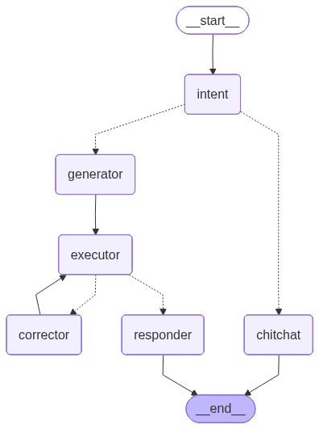
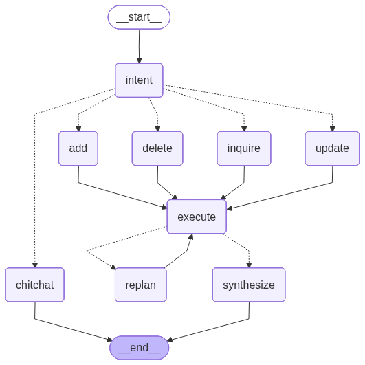

# Inventory Chatbot (SQL Agent)

This project implements a sophisticated chatbot capable of translating natural language questions into SQL queries to interact with an inventory database. The agent can determine user intent, generate and execute queries, and even correct itself if a query fails.

---

## State

The agent's state is maintained throughout the conversation and includes:

-   **`message`**: The history of messages between the user and the bot.
-   **`question`**: The user's current question or input.
-   **`sql_query`**: The SQL query generated by the LLM to answer the user's question.
-   **`sql_result`**: The result retrieved from executing the SQL query.
-   **`error`**: A field to hold any error messages if a SQL query fails.
-   **`intent`**: The classified intent of the user's message (either `CHITCHAT` or `generator`).

---

## Nodes

The agent's logic is structured into six distinct nodes:

1.  **`intent_node`**: Determines if the user's message is conversational (`CHITCHAT`) or requires a database query (`generator`).
2.  **`chitchat_node`**: Generates a friendly, conversational response without accessing the database.
3.  **`sql_generator_node`**: Generates a SQL query based on the user's question.
4.  **`sql_executor_node`**: Executes the generated SQL query against the database.
5.  **`sql_corrector_node`**: If an error occurs, this node refines the SQL query until it executes successfully.
6.  **`responder_node`**: Generates a final, human-readable response for the user based on the SQL query result.

---

## Flow Control Functions

The flow between nodes is managed by two routing functions:

-   **`intent_should_continue`**: Routes the conversation to the `sql_generator_node` for database queries or the `chit_chat_node` for conversation.
-   **`executor_should_continue`**: Manages the query-execution loop. On success, it proceeds to the `responder_node`. On failure, it routes back for correction.

---

## Graph Structure

The nodes are connected in a graph to define the agent's workflow:

---

## Main Function

The main function runs a loop that allows a user to interact with the bot from the command line. The conversation continues until the user types **"exit"**.

# NEO4J Knowledge Graph Agent

This project implements an advanced agent capable of interacting with a Neo4j graph database. It can understand user intent, perform CRUD (Create, Read, Update, Delete) operations, handle conversational chit-chat, and even self-correct failed database queries. The agent maintains a semantic memory to provide contextually aware responses.

---

## State (`AgentState`)

The agent's state is maintained throughout the conversation and contains the following fields:

-   `messages`: A history of the conversation between the user and the agent.
-   `question`: The most recent question or input from the user.
-   `intent`: The user's classified intent (e.g., `ADD`, `INQUIRE`, `CHITCHAT`).
-   `cypher`: The generated Cypher query to be executed against the Neo4j database.
-   `cypher_result`: The result retrieved from executing the Cypher query.
-   `error`: Any error messages that occur during query execution.
-   `semantic_memory`: Facts and preferences retrieved from memory that are relevant to the current question.
-   `revision_count`: A counter for how many times a query has been revised.

---

## Core Architecture

The agent is built using a state graph, where nodes represent specific functions and edges control the flow of logic.

### Key Components

-   **Semantic Memory**: The agent extracts key facts and user preferences during conversation. These are stored in a Redis vector store and retrieved based on semantic similarity to the user's current query, providing rich context for generating Cypher queries and responses.
-   **Database Interaction**: A custom `_AuraGraphStore` class handles all communication with the Neo4j database, ensuring compatibility and proper data serialization.
-   **Self-Correction Loop**: If a Cypher query fails, the agent enters a replanning loop. The `replan_node` attempts to fix the query based on the error message, and the `executor_should_continue` logic routes it back for re-execution, up to a maximum of three revisions.

### Nodes

The graph consists of nine nodes, each performing a distinct task:

1.  **`intent_node`**: The entry point. It analyzes the user's message to determine the intent (`CHITCHAT`, `ADD`, `UPDATE`, `DELETE`, `INQUIRE`), extracts key facts for semantic memory, and retrieves relevant memories to add to the state.
2.  **`chitchat_node`**: Handles conversational, non-database-related interactions, providing a polite and helpful response.
3.  **`add_node`**: Generates a Cypher query to create new nodes or relationships in the graph based on the user's request.
4.  **`update_node`**: Generates a Cypher query to modify existing data in the graph.
5.  **`inquire_node`**: Generates a Cypher query to retrieve information from the graph.
6.  **`delete_node`**: Generates a Cypher query to remove data from the graph.
7.  **`execute_cypher`**: Executes the generated Cypher query against the Neo4j database, capturing either the result or an error.
8.  **`replan_node`**: The self-correction node. If `execute_cypher` produces an error, this node receives the broken query and the error message and generates a corrected Cypher query.
9.  **`synthesize_node`**: The final step for database interactions. It processes the `cypher_result` (or lack thereof) and synthesizes a clear, human-readable response for the user.

---

## API and Conversational Memory

The agent is exposed via a FastAPI REST API, making it easy to integrate into web applications.

-   **Short-Term Memory**: The API's `/chat` endpoint requires a `thread_id` with each request. This `thread_id` is the key to maintaining **short-term conversational memory**. It allows the agent to track the state of a specific conversation across multiple interactions. A Redis checkpointer saves the graph's state after each turn, ensuring that context (like previous messages and query results) is preserved for the next request in the same thread.

-   **Long-Term Semantic Memory**: In addition to short-term memory, the `thread_id` is also used to create a unique namespace for storing long-term facts and user preferences in the Redis vector store.

---

## Flow Control and Routing

Two conditional routing functions manage the agent's path through the graph:

-   **`intent_router`**: Directs the flow from the `intent_node` to the appropriate action node (`add`, `update`, `inquire`, `delete`) or to the `chitchat_node` based on the classified intent.
-   **`executor_should_continue`**: Evaluates the state after a query execution. On success, it proceeds to the `synthesize` node. On failure, it routes to the `replan_node` for correction. If revisions fail three times, it gives up and proceeds to `synthesize` to inform the user.

---

## Graph Structure

The nodes are connected to create a logical flow for handling user requests:

1.  Execution begins at the `intent_node`.
2.  Based on the intent, the graph routes to `chitchat_node` (which ends the flow) or to one of the Cypher-generating nodes (`add`, `inquire`, etc.).
3.  All Cypher-generating nodes pass their query to the `execute_cypher` node.
4.  `execute_cypher` attempts to run the query. If it succeeds, it proceeds to `synthesize_node`. If it fails, it enters the self-correction loop with `replan_node`.
5.  The `replan_node` sends its corrected query back to `execute_cypher`.
6.  Finally, the `synthesize_node` generates the final response to the user, and the flow ends.

---

## `run_agent` Script

The main function contains the loop to run the bot, allowing a user to interact with it from the command line. The user can type inputs and receive responses until they enter **"exit"**.